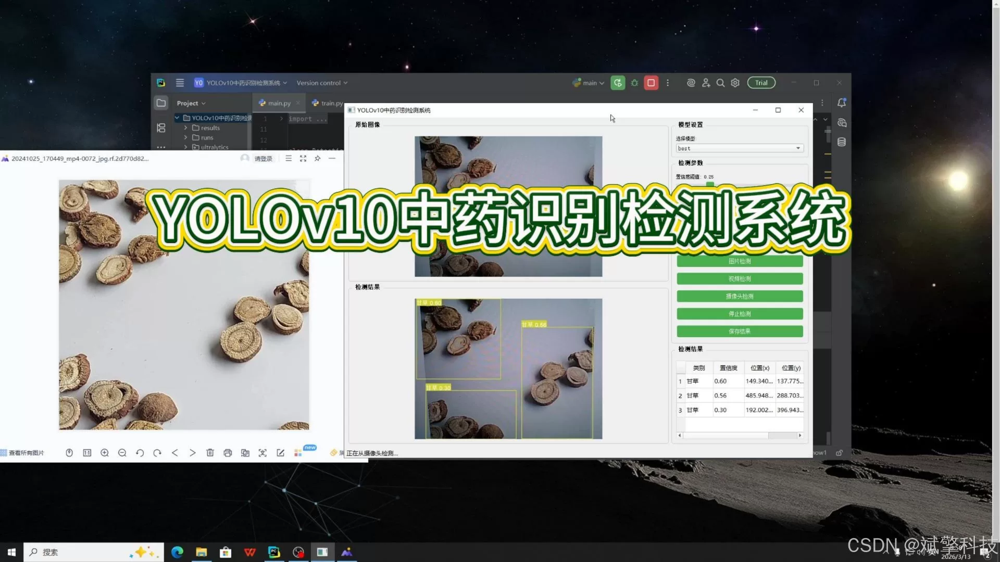
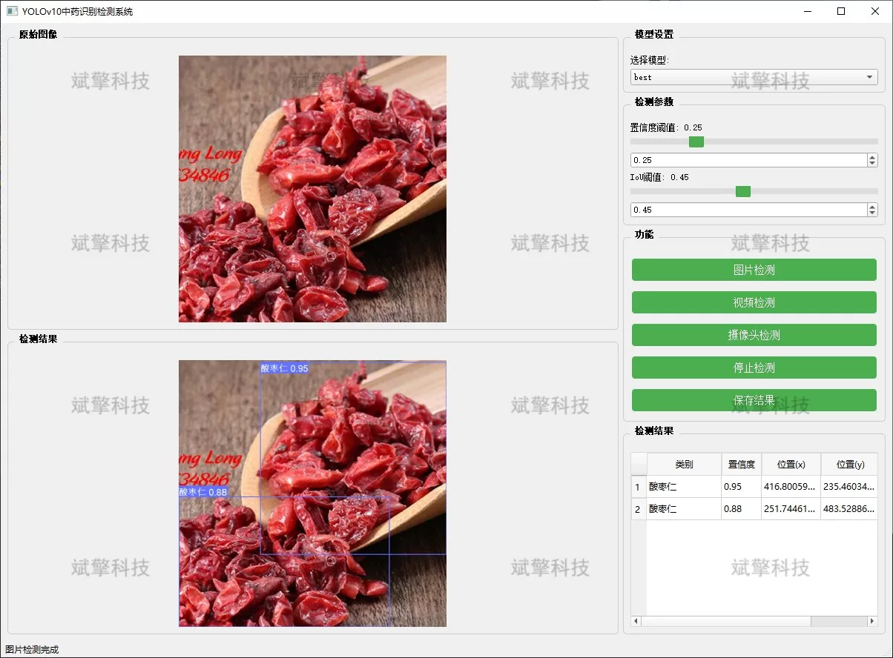
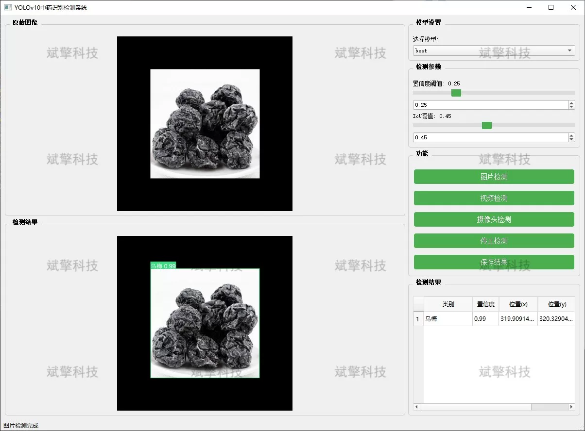
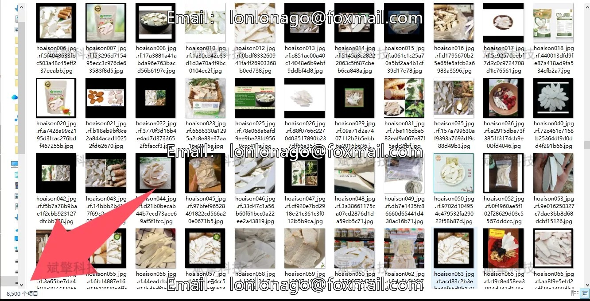
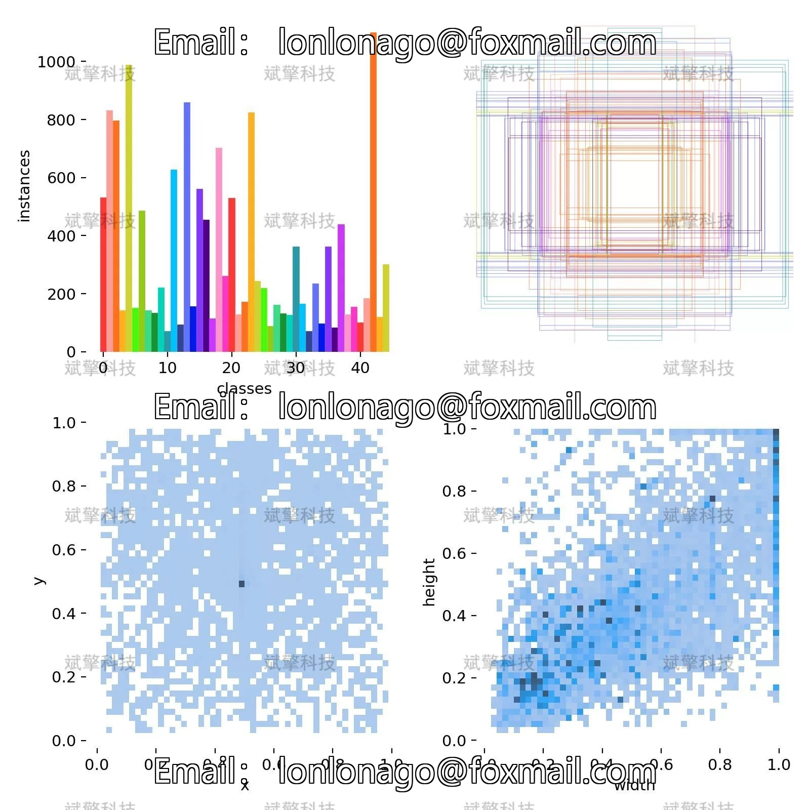
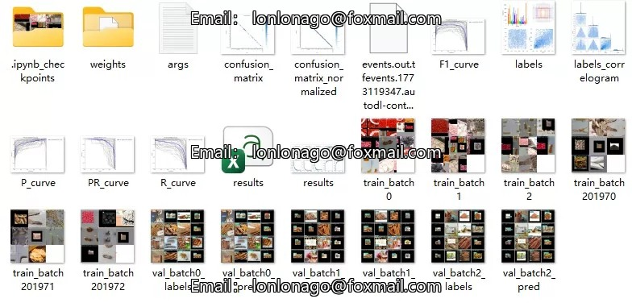
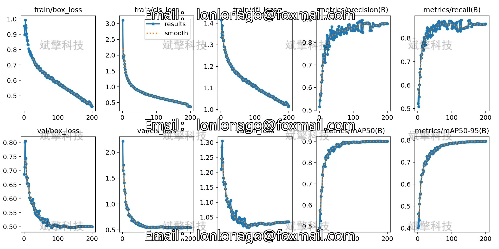
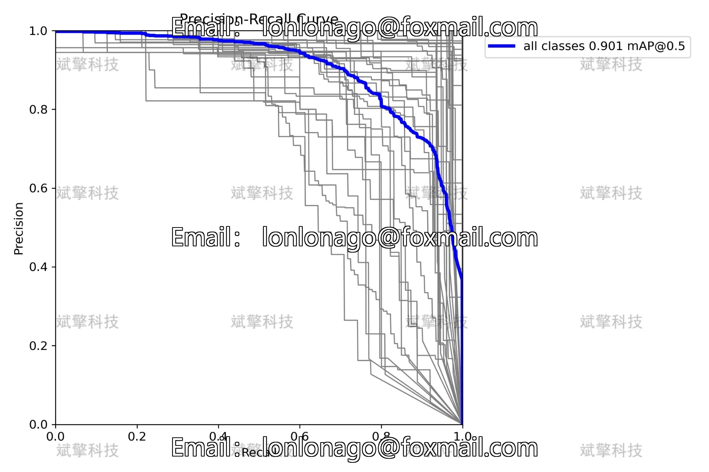
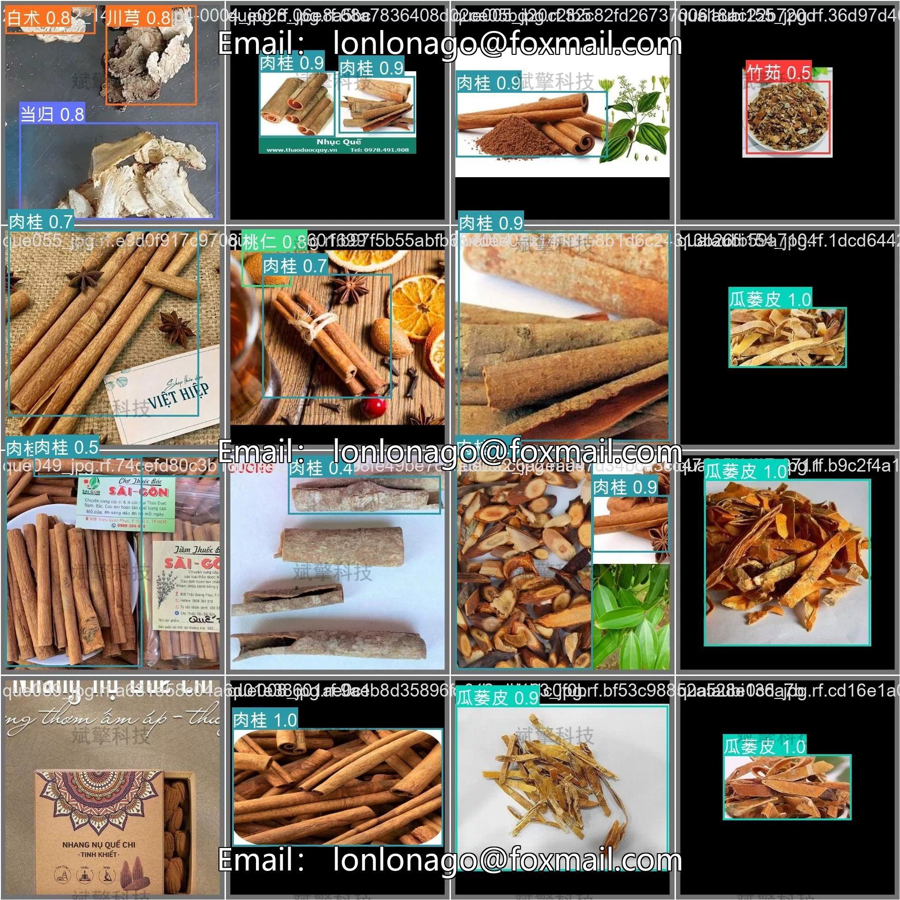

# Based on YOLOv10 deep learning for traditional Chinese medicine identification detection system (YOLOv10)

## Body

Based on the YOLOv10 deep learning, a traditional Chinese medicine identification detection system (YOLOv10+YOLO dataset + UI interface + Python project + model) has been developed.

With the deep integration of artificial intelligence and modernization of traditional Chinese medicine, the computer vision technology based on deep learning provides a brand-new solution for the automatic discrimination and classification of Chinese medicinal materials. This system is based on the latest YOLOv10 object detection algorithm, and it develops a high-precision intelligent detection and recognition system targeting the visual characteristics of 45 common Chinese medicinal materials such as Poria cocos, Paeonia lactiflora, Atractylodes macrocephala, Ginseng, Gastrodia elata, Fritillaria cirrhosa, etc. The system supports three detection modes: image, video, and real-time camera, and can accurately locate and classify the collected medicinal material images in real time. The research aims to solve the problems of low efficiency and subjectivity in traditional manual identification, providing efficient and standardized technical support for the circulation regulation of Chinese medicinal materials, intelligent pharmacies, and medicinal material planting management.
This system is an intelligent identification platform for Chinese medicinal materials that integrates deep learning, computer vision, and interactive design. In response to the challenges of the diverse market varieties of Chinese medicinal materials and the difficulty in distinguishing some medicinal materials due to their similar appearance, the project utilizes the excellent performance of YOLOv10 algorithm in terms of real-timeness and accuracy to build a target detection model specifically for 45 types of Chinese medicinal materials.

System Features
✅ Image detection: Can detect images and return detection boxes and category information.
✅ Video detection: Supports input of video files, detecting each frame in the video.
✅ Real-time camera detection: Connects USB cameras to achieve real-time monitoring.
✅ Parameter adjustment in real time (confidence and IoU thresholds)
Dataset Introduction
Train set (Train): 5019 images
Validation set (Val): 1233 images

## Images

## Payment

Here is a pay link on Stripe ( https://buy.stripe.com/3cs8yP7sY87d0vu9AB ). Please contact me lonlonago@foxmail.com after funding $89, and I will send you a complete data files , thank you!

